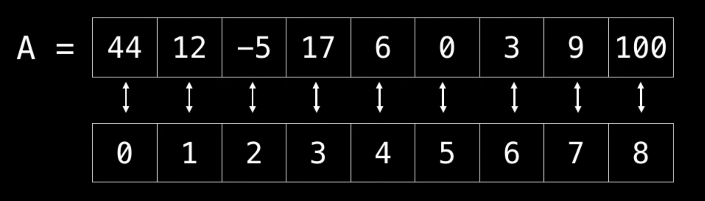
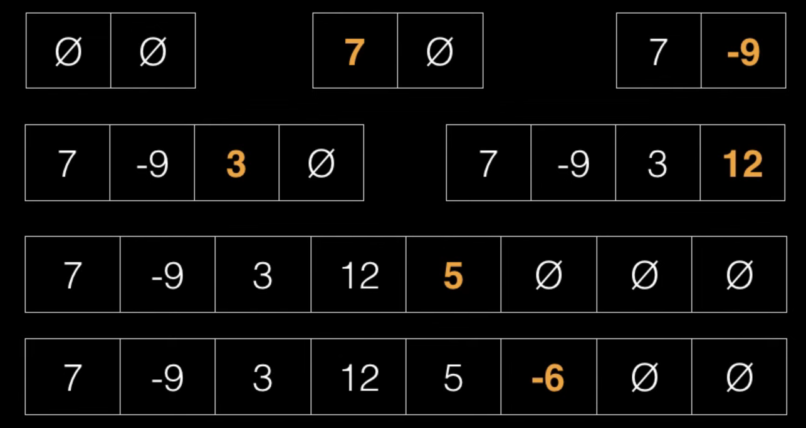
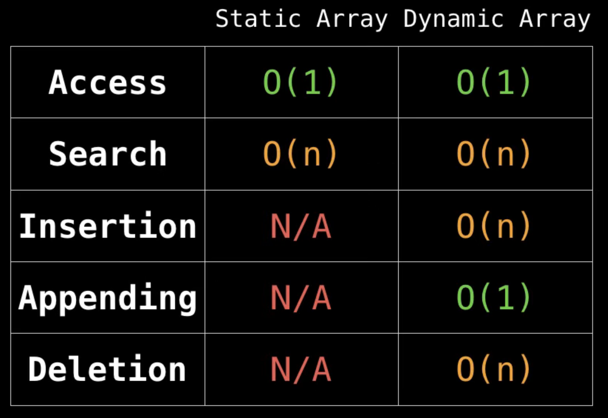

# Dynamic and Static Array

## Static Array

A static array is a fixed length container containing n elements indexable from the range [0, n-1].

Normally, this kind of array is save on the memory in a continuous slot.

## Dynamic Array

Dynamic Array can grow and shrink in size as needed

We create a static array with N capacity(cap). When we need add more elements than our cap, is created a new array with the double cap.

## Complexity

