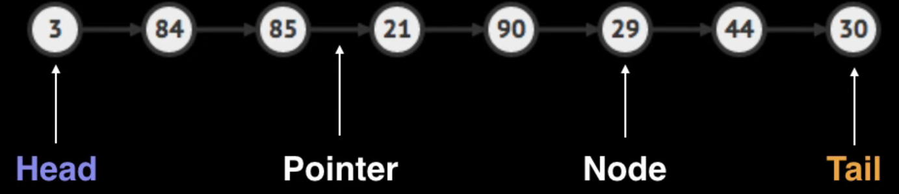

# Linked List

## What is it?

A linked list is a sequencial list of nodes that hold data which point to other nodes also containing data.

## Where is it used?

- In lists implementations, such Queue and Stacks.
- In circular lists. The last node points to the first node

## Singly Linked Lists

**Singly** linked list only hold a reference to the next node. You always maintain a reference to the head and to the tail nodes for quick additions/removals

3 ===> 10 ===> 0 ===> 9

Pros:

- Uses less memory
- Simpler Implementation

Cons:

- Cannot easily access previous elements

## Doubly Linked Lists

**Doubly** linked list hold a reference to the next and the previous node. You always maintain a reference to the head and to the tail nodes for quick additions/removals from both ends.

3 <===> 10 <===> 0 <===> 9

Pros:

- Can be traversed backwards

Cons:

- Takes 2x memory

## Complexity of both types

- search: O(n)
- Insert at head: O(1)
- Insert at tail: O(1)
- Remove at head: O(1)
- Remove at middle: O(n)

### There is only one different case

Remove at tail:

- Singly: O(n)
- Doubly: O(1)
