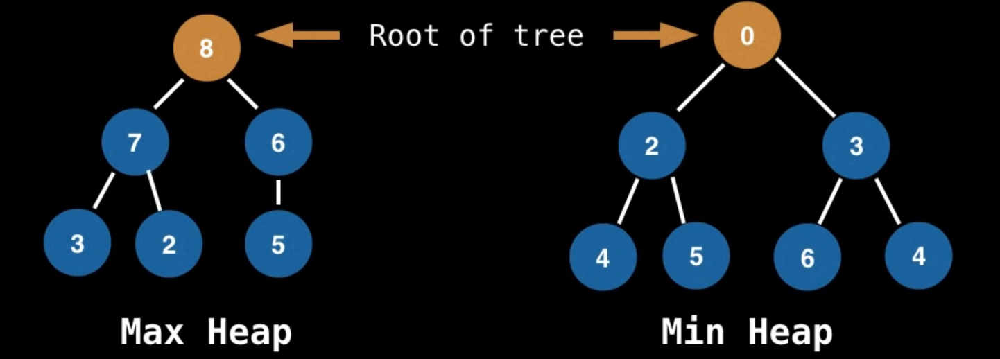
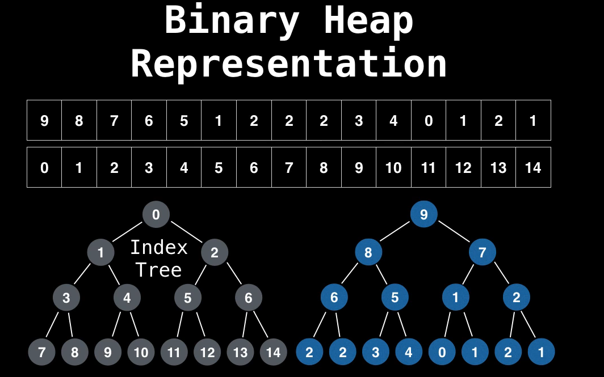

# Priority Queues and Heaps

## What is it?

A Priority Queue is a Abstract DataType that operates similar to a normal queue, except that each element has a certain priority.

Specifications:

- Supports only comparable data
- Should have a logic to compare elements
  - either from least to greatest
  - either from greatest to least
  - either other logic

## Operations

- **add:** add elements
- **poll:** remove priority elements

## What is a Heap?

It is a tree based Data Structure that satisfies the heap invariant (also called heap property):
If A is a parent node of B then A is ordered with respect to B for all nodes A, B in the heap.

- **MIN Heap:** The parents nodes are always smaller than your children
- **MAX Heap:** The parents nodes are always greater than your children

## Priority Queues VS Heaps

A Priority Queue is a Abstract Data Structure, thats mean it can be implemented using some Data Structure.

A Heap is a data structure, and can be used to create Priority Queues.

## Uses

- Used in certain implementations of Dijkstra's Shortest Path algorithm.
- Anytime you need the dynamically fetch the 'next best' or 'next worst' element
- Best First Search (BFS) algorithms such as A* use PQs to continuously grab the next most promising node.
- Used by Minimum Spanning Tree (MST) algorithms.

## Complexity: PQ with binary Heap

- Binary Heap construction: O(n)
- Polling: O(log(n))
- Peeking: O(1)
- Adding: O(log(n))
- Naive Removing: O(n)
- Advanced removing with help from a hash table *: O(log(n))
- Naive contains: O(n)
- Contains check with help of a hash table *: O(1)

## Ways of implementing a PQ

Priority Queue are usually implemented with Binary Heaps since this gives them the best possible time complexity.

### Array Representation

Let i be the parent node index:

- Left child index: 2i + 1
- Right child index: 2i + 2

## Adding Elements to Binary Heap

Steps:

1. Put the new value on the bubbling up position: In trees is the last line at left, in array is the last position
2. Compare it with its parent
    1. If the heap invariant is violated, change them
    2. If the heap invariant is not violated, next
3. Continue doing the step 2 until we get the 2.2

## Removing/Polling Elements to Binary Heap

### Polling

In general with Heaps, we always want to remove the root value, because its the node with high priority.

Steps:

1. Save the root value
2. Swap the root with the last position
3. Compare root with your children and select the smallest. When we have a tie, select the left one
    1. If the heap invariant is violated, change them (bubbling down)
    2. If the heap invariant is not violated, next
4. Continue doing the step 2 until we get the 2.2

### Removing

However, sometimes it's necessary remove other elements.

#### Naive removing steps

1. Search in all nodes to find the element who you wants remove
2. Swap it with the last position: In trees is the last line at left, in array is the last position
3. Return and remove the last element
4. And now, we bubbling the node that changed position until heap invariant, like the other cases.
    - Check both parent and children

#### Removing using Hash Tables steps

Watch: https://youtu.be/eVq8CmoC1x8?si=t561DTUPJ8WrBUUh&t=660

Visualize it is better
